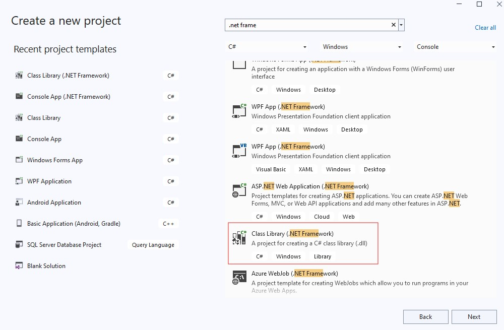

## Create C# function under T-SQL

#### First step : Create your function

Create a new project in Visual studio. Make sure that the project is .NET Framework class library.

  

Write your function and build the DLL file.

#### Second step : Register your function in MS-SQL server

Follow the instructions in register.sql file. 
> #### Please use this method only test environment because this DLL is not signed CLR function so the CLR security will turn off by the sql script.

